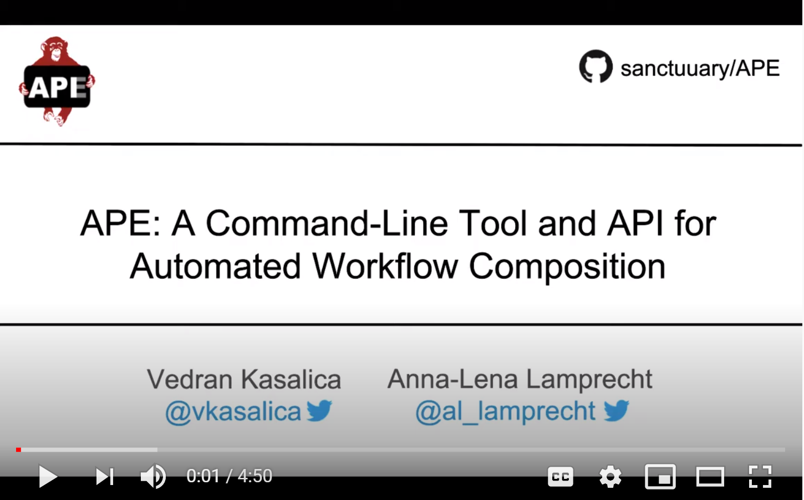

# APE (Automated Pipeline Explorer)

[](https://github.com/sanctuuary/APE/releases/latest)
[](https://travis-ci.org/sanctuuary/APE)
[](https://github.com/sanctuuary/APE/blob/master/LICENSE)

APE is a command line tool and Java API [[1]](#1) for the automated exploration of possible computational pipelines (scientific workflows) from large collections of computational tools. 

APE relies on a semantic domain model that includes tool and type taxonomies as controlled vocabularies for the description of computational tools, and functional tool annotations (inputs, outputs, operations performed) using terms from these taxonomies. Based on this domain model and a specification of the available workflow inputs, the intended workflow outputs and possibly additional constraints, APE then computes possible workflows. 

Internally, APE uses a component-based program synthesis approach. It translates the domain knowledge and workflow specification into logical formulas that are then fed to a SAT solver to compute satisfying instances. These solutions are then translated into the actual candidate workflows. For detailed description we refer to [[2]](#2).

For [ICCS 2020](https://www.iccs-meeting.org/iccs2020/) we created a video that explains APE [[1]](#1) in 5 minutes:
<div align="left">
  <a href="https://www.youtube.com/watch?v=CzecqRJXmoM" target="_blank"></a>
</div>

## Requirements
To [run](https://github.com/sanctuuary/APE#command-line-interface-cli) APE you need to have [Java 1.8](https://www.oracle.com/java/technologies/javase-jdk8-downloads.html) (or higher) installed on your system. To [build](https://github.com/sanctuuary/APE#how-to-build-ape-from-source-using-maven) APE from source, [Maven 3.3+](https://maven.apache.org/download.cgi) has to be installed as well.

### Releases
| Date       | Version | Download                                                                             |
|------------|---------|--------------------------------------------------------------------------------------|
| 15-07-2020 | 1.0.1   | [jar](https://repo.maven.apache.org/maven2/io/github/sanctuuary/APE/1.0.0/APE-1.0.0.jar), [executable](https://repo.maven.apache.org/maven2/io/github/sanctuuary/APE/1.0.0/APE-1.0.0-executable.jar), [javadoc](https://repo.maven.apache.org/maven2/io/github/sanctuuary/APE/1.0.0/APE-1.0.0-javadoc.jar), [sources](https://repo.maven.apache.org/maven2/io/github/sanctuuary/APE/1.0.0/APE-1.0.0-sources.jar)|

## How to add APE to your Maven project
To add a dependency on APE using Maven, use the following:
```xml
<!-- https://mvnrepository.com/artifact/io.github.sanctuuary/APE -->
<dependency>
    <groupId>io.github.sanctuuary</groupId>
    <artifactId>APE</artifactId>
    <version>1.0.1</version>
</dependency>
```
For more information (regarding Gradle, Ivy, etc.) check the [APE mvn repository](https://mvnrepository.com/artifact/io.github.sanctuuary/APE/1.0.0).


### How to build APE from source (using Maven)
From the project root, simply launch
```shell
$ mvn -DskipTests=true install
```
to build the APE modules from the source tree and the built files will be generated under the `/target` directory. All the dependencies will be gathered by Maven and the following stand-alone module will be generated: `APE-<version>-executable.jar`

## Using APE
Automated workflow composition with APE can be performed through its command line interface (CLI) or its application programming interface (API). While the CLI provides a simple means to interact and experiment with the system, the API provides more flexibility and control over the synthesis process. It can be used to integrate APE’s functionality into other systems.

### Command line interface (CLI)
When running APE-&lt;version>.jar from the command line, it requires a JSON configuration file given as a parameter and executes the automated workflow composition process accordingly. This configuration file (see [APE cofiguration example](https://github.com/sanctuuary/APE_UseCases/blob/master/ImageMagick/Example1/ape.configuration) and [APE configuration documentation](https://github.com/sanctuuary/APE_UseCases#configuration-file)) provides references to all therefor required information:
1. *Domain model* - classification of the types and operations in the domain in form of an **ontology** (see [ontology example](https://github.com/sanctuuary/APE_UseCases/blob/master/ImageMagick/imagemagick_taxonomy.owl) in OWL) and a **tool annotation file** (see [tool annotations example](https://github.com/sanctuuary/APE_UseCases/blob/master/ImageMagick/tool_annotations.json) in JSON).
2. *Workflow specification* - including a list of **workflow inputs/outputs** and template-based (see [constraint templates](https://github.com/sanctuuary/APE_UseCases/blob/master/ImageMagick/Example1/constraint_templates.json)) **workflow constraints** (see [workflow constraints example](https://github.com/sanctuuary/APE_UseCases/blob/master/ImageMagick/Example1/constraints.json))
3. *Parameters* for the synthesis execution, such as the number of desired solutions, output directory, system configurations, etc. (see [APE configuration documentation](https://github.com/sanctuuary/APE_UseCases#configuration-file)).

To run the APE CLI use:

```shell
java -jar APE-<version>.jar configuration.json
```

For more details check the [demo use case](https://github.com/sanctuuary/APE_UseCases/tree/master/ImageMagick).

### Application programming interface (API)

Like the CLI, the APE API relies on a configuration file that references the domain ontology, tool annotations, workflow specification and execution parameters:

```java
// set up the framework
APE ape = new APE("path/to/setup-configuration.json");

// run the synthesis
SATsolutionsList solutions = ape.runSynthesis("path/to/run-configuration.json");
// write the solutions for the file system
APE.writeSolutionToFile(solutions);
APE.writeDataFlowGraphs(solutions, RankDir.TOP_TO_BOTTOM);
APE.writeExecutableWorkflows(solutions);
```

However, the API allows to generate and edit the configuration file programmatically:

```java
// set up the framework
APECoreConfig coreConfig = new APECoreConfig(...);
APE ape = new APE(coreConfig);

// run the synthesis
APERunConfig runConfig = APERunConfig.builder().withSolutionMinLength(1).withSolutionMaxLength(10)
                                                .withMaxNoSolutions(100).withApeDomainSetup(ape.getDomainSetup())
                                                .build();
SATsolutionsList solutions1 = ape.runSynthesis(runConfig);

// run the synthesis again with altered parameters
runConfig.setUseWorkflowInput(ConfigEnum.ONE);
SATsolutionsList solutions2 = ape.runSynthesis(runConfig);
```

## Use cases and demos
Our use cases are motivated by practical problems in various domains (e.g. bioinformatisc, GIS [[3]](#3)). Different examples are available at [GitHub Use Cases Repository](https://github.com/sanctuuary/APE_UseCases).

For one of the bioinformatics use cases our intern Karl Allgaeuer developed a prototype of a web-based interface to APE. It is available at http://ape.science.uu.nl/ (alpha).
A Docker version of this demonstrator is available at https://github.com/sanctuuary/Burke_Docker

## The APE team
* Vedran Kasalica (v.kasalica@uu.nl), lead developer
* Maurin Voshol, student developer
* Anna-Lena Lamprecht, project initiator and principal investigator

## Contact
For any questions concerning APE please get in touch with Vedran Kasalica (v.kasalica@uu.nl).

## Contributions
We welcome contributions (bug reports, bug fixes, feature requests, extensions, use cases, ...) to APE. Please get in touch with Vedran Kasalica (v.kasalica@uu.nl) to coordinate your contribution. We expect all contributors to follow our [Code of Conduct](https://github.com/sanctuuary/APE/blob/master/CODE_OF_CONDUCT.md).

## Credits
APE has been inspired by the [Loose Programming framework PROPHETS](http://ls5-www.cs.tu-dortmund.de/projects/prophets/index.php). It uses similar mechanisms for semantic domain modeling, workflow specification and synthesis, but strives to provide the automated exploration and composition functionality independent from a concrete workflow system.

We thank our brave first-generation users for their patience and constructive feedback that helped us to get APE into shape. 

## License
APE is licensed under the [Apache 2.0](https://github.com/sanctuuary/APE/blob/master/LICENSE) license.

#### Maven dependencies

1. [**OWL API**](https://mvnrepository.com/artifact/net.sourceforge.owlapi/owlapi-distribution) - LGPL or Apache 2.0
2. [**SAT4J**](https://mvnrepository.com/artifact/org.apache.logging.log4j/log4j-core) - EPL or GNu LGPL
3. [**apache-common-lang**](https://mvnrepository.com/artifact/org.apache.commons/commons-lang3) - Apache 2.0
4. [**graphviz-java**](https://mvnrepository.com/artifact/guru.nidi/graphviz-java) - Apache 2.0
5. [**org.json**](https://mvnrepository.com/artifact/org.json/json) - [JSON license](https://www.json.org/license.html)

## References
<a id="1">[1]</a> 
Kasalica V., Lamprecht AL. (2020) 
APE: A Command-Line Tool and API for Automated Workflow Composition. 
ICCS 2020. ICCS 2020. Lecture Notes in Computer Science, vol 12143. Springer,
https://doi.org/10.1007/978-3-030-50436-6_34


<a id="2">[2]</a> 
Kasalica, V., & Lamprecht, A.-L. (2020). 
Workflow Discovery with Semantic Constraints:
The SAT-Based Implementation of APE. Electronic Communications of the EASST, 78(0).
https://doi.org/10.14279/tuj.eceasst.78.1092


<a id="3">[3]</a> 
Kasalica, V., & Lamprecht, A.-L. (2019). 
Workflow discovery through semantic constraints: A geovisualization case study. 
In Computational science and its applications – ICCSA 2019
(pp. 473–488), Springer International Publishing,
https://doi.org/10.1007/978-3-030-24302-9_53
